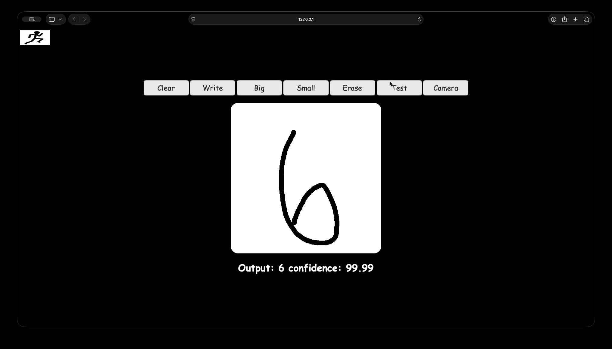

# Handwritten-Digit-Classifier

**Convolutional Neural Networks** (CNNs) are specialized for processing grid-like data, such as images. CNNs use convolutional layers to detect spatial hierarchies, making them ideal for computer vision tasks.

**Handwritten Digit Classifier**: Train an FNN on the MNIST dataset to recognize handwritten digits.

# Demo

## Input

Handwritten digit from frontend  

## Output

The CNN model predicts the digit and provides a confidence score for each possible class.  

**Team Members**
- Oscar Silva-Santiago
- Carter Tipton
- Matthew Barnes

To save required libs
`pip freeze > requirements.txt`

To install required libs
`pip install -r requirements.txt`  
Note - if this does not work, just pip install django, mathplot, pandas, tensorflow, numpy and other stuff in requirements.txt

To run server, under project directory
`python manage.py runserver`

Go launch the web app after running script  
http://127.0.0.1:8000/  
or  
http://localhost:8000/
